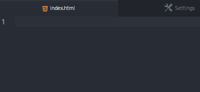
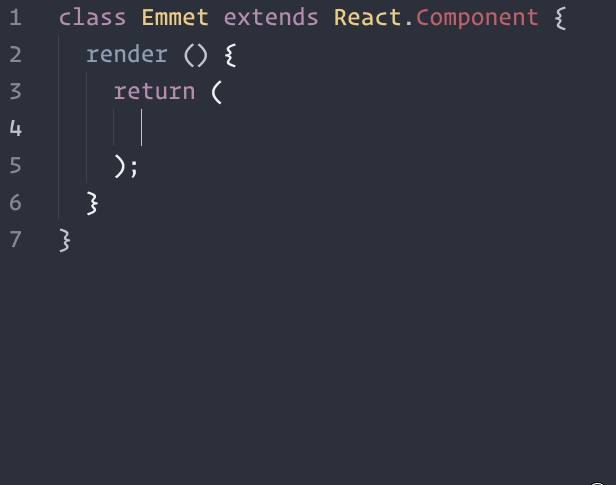

Todos nós programadores, preocupados com agilidade, temos, em nossos editores de texto/código, uma série de *snippets*, *plugins* ou *packages* que que nos auxiliam na codificação e facilitam nosso dia a dia. Um exemplo disso é o [Emmet](http://emmet.io/).<!-- more --> Se você não conhece essa ferramenta, dá uma conferida nesse [artigo](http://tableless.com.br/bye-zen-coding-bem-vindo-emmet/) que vai te dar um panorama da utilidade do *__Emmet__*. A questão é que ele melhora e muito o fluxo de trabalho de quem está escrevendo *html* ou *css*.
Dá uma olhada nesse exemplo simples de como ele funciona.



### Tab do Emmet com JSX
Tá mais e aí? O *Emmet* é uma mão na roda. Já sabemos.
O que acontece é que, codando em JSX para construir componentes [React](https://facebook.github.io/react/), por exemplo, o costumeiro *tab* do *Emmet* não funciona! Vocês certamente já se depararam com essa situação. E é muito frustante não ter aquela agilidade de antes, já que no *JSX* também escrevemos *tags* *html* e temos que fazer isso *na unha*.
E é aí que vem uma dica sensacional para nós desenvolvedores. Conseguimos habilitar o mesmo comportamento do *html* normal para *JSX*.
Para conseguimos isso, já temos que ter instalados os seguintes *packages*: `emmet` e o `language-babel`
Após verificar esses requisitos é só seguir os seguintes passos:
1. Abrir o arquivo `keymap.cson` clicando em `edit -> Keymap…` no menu
2. Adicionar este código ao `keymap`:

``` bash
'atom-text-editor[data-grammar~="jsx"]:not([mini])':
  'tab': 'emmet:expand-abbreviation-with-tab'

```

E aí está!

Se caso você use *__aspas simples__* para escrever os atributos, temos uma *config* para isso também!
É só criar o arquivo `syntaxProfiles.json` na pasta `~/emmet` e usar o seguinte código:
``` json
{
  "html": {
    "tag_case": "lower",
    "attr_quotes": "single",
    "self_closing_tag": true
  },
  "jsx": {
    "tag_case": "lower",
    "attr_quotes": "single",
    "self_closing_tag": true
  }
}
```  


É isso, espero que ajude no desenvolvimento de vocês.
Um abraço.

> PS: Esse post foi escrito com base nesse [Gist](https://gist.github.com/mxstbr/361ddb22057f0a01762240be209321f0) (em Inglês)