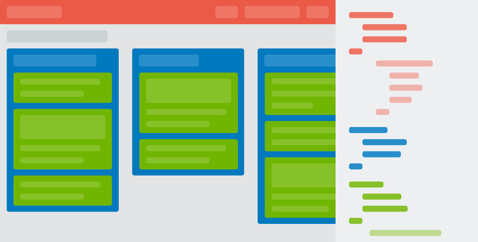
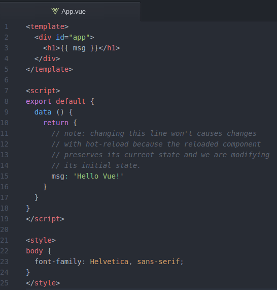
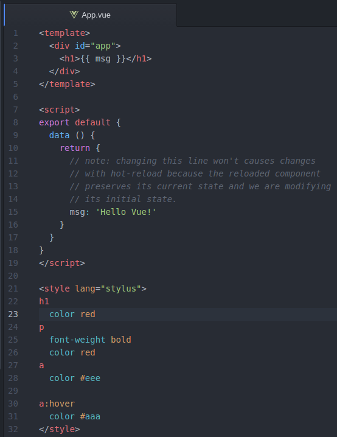

O [VueJS](http://vuejs.org) é uma `library` incrível para a construção de componentes para interfaces web e que vem a cada dia conquistando espaço na comunidade de desenvolvedores mundo afora, inclusive aqui no Brasil. A comunidade brasileira de **VueJS** está crescendo, produzindo e compartilhando bastante material de qualidade.<!-- more --> E aproveitando esse momento em que todos estão explorando suas funcionalidades, queria compartilhar esse artigo **que vai abordar como extrair o CSS de componentes `Vuejs`, usando pré-processadores(ou não) e fazer o `build` num arquivo separado, já minificado.**

Vamos lá então!

## VueJS + Webpack: vue-cli
Precisamos antes de tudo de gerar um projeto, e para isso, vamos usar o [vue-cli](https://github.com/vuejs/vue-cli), que faz um `scaffolding` de uma aplicação `Vuejs`, e nos fornece alguns `templates` com uma estrutura já pré-configurada.
Sua instalação pode ser feita através do [npm](https://www.npmjs.com/):
``` bash
$ npm install -g vue-cli

```
Depois de instalado o `CLI`, é só escolher um dos [templates listados](https://github.com/vuejs/vue-cli#official-templates) na documentação. Nesse artigo, vamos usar o _template_ `webpack-simple`. Sua instalação é a seguinte:

``` bash
$ vue init webpack-simple
$ npm install

```

Podemos ver que o `vue-cli` gerou uma estrutura para trabalharmos com componentes([Vue component](http://vuejs.org/guide/application.html#Single-File-Components)) no `VueJS`. E é desses componentes que vamos extrair nosso _CSS_.   



## Usando o Extract Text Plugin para extrair o CSS
O [Extract Text Plugin](https://github.com/webpack/extract-text-webpack-plugin) vai extrair o CSS de cada `Vue Component` para um arquivo separado, definido por nós.
Vamos instalá-lo então:
``` bash
$ npm install extract-text-webpack-plugin --save-dev

```
Após isso, temos que configurar o arquivo `webpack.config.js` que está na raiz do projeto.
``` javascript
var ExtractTextPlugin = require('extract-text-webpack-plugin');
module.exports = {
  // ... outras configurações
  vue: {
    loaders: {
      css: ExtractTextPlugin.extract('css')
    }
  },
  plugins: [
      new ExtractTextPlugin('styles.css')
  ]
}

```

Estamos dizendo para o `webpack` usar uma configuração do [vue-loader](http://vue-loader.vuejs.org/en/configurations/extract-css.html), que vai processar, extrair e minificar todo o _CSS_ dos `Vue Components` usando o _Extract Text Plugin_, enviando tudo para o arquivo `style.css` na pasta `dist/`, que será criada no `build` do projeto.

Para termos certeza que o arquivo está sendo gerado, é só irmos ao _terminal_ e rodar o comando de `build`:
``` bash
$ npm run build

```
Você deve ter algo semelhante a esta estrutura agora:
``` bash
|--seu-projeto-vue
  |--dist
    build.js
    build.js.map
    styles.css
    styles.css.map
  |--node_modules
  |--src
  ... demais arquivos

```

Porém, aqui cabe uma questão: **Como você escreve seu CSS?**
Podemos usar `plain CSS` ou `pre-processors` para escrever o _CSS_ dos nossos componentes. É uma escolha pessoal. Eu, por exemplo, uso [stylus](http://stylus-lang.com/) como pré-processsador, mas se você usa [SASS](https://github.com/jtangelder/sass-loader) ou [LESS](https://github.com/webpack/less-loader), existem `loaders` `webpack` para os dois também.

Se a escolha for por `pre-processors`, faça a instalação do `loader` conforme sua preferência.
Nesse artigo vamos usar o [Stylus](https://github.com/shama/stylus-loader), então temos que instalar, além do `stylus-loader`, o próprio `stylus`.

``` bash
$ npm install stylus stylus-loader --save-dev

```
 E alterar a configuração do `loader` que setamos acima para:

``` javascript
vue: {
  loaders: {
    stylus: ExtractTextPlugin.extract('css!stylus')
  }
}

```
Agora, temos que aplicar uma mudança nos nossos `Vue Components` para que possamos usar de fato o pré-processsador. Vamos colocar o _atributo_ `lang` com a valor `stylus`, ou o seu pré-processsador preferido,  na `tag` `<style>`, como está na figura:



A partir de agora teremos nosso CSS escrito em `Stylus` sendo compilado dos nossos componentes, extraido e minificado no arquivo `style.css`. É só rodar o comando de `build` novamente e conferir o arquivo na pasta `dist/`.

Lembrando que temos que referenciar o `styles.css` no nosso `index.html`.
``` bash
<!DOCTYPE html>
<html lang="en">
  <head>
    <meta charset="utf-8">
    <title>example-vue</title>
    <link rel="stylesheet" href="dist/styles.css">
  </head>
  <body>
    <app></app>
    <script src="dist/build.js"></script>
  </body>
</html>
```
## Conclusão
Vimos como fazer o `build` do projeto, extraindo o _CSS_ dos componentes `Vue` para um arquivo separado, usando ou não pré-processadores.

Espero ter ajudado.
Qualquer _feedback_, é só deixar nos comentários :)

> No próximo artigo veremos como usar arquivos CSS externos em aplicações VueJS + Webpack.

Um abraço.