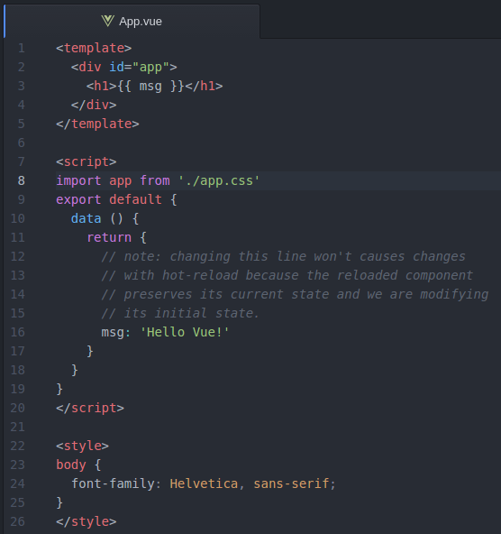
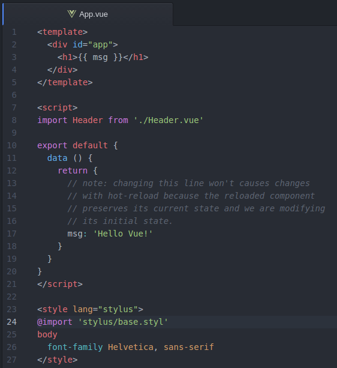

No _post_ anterior, mostrei [como extrair o css de compoentes VueJS para um arquivo separado]( /extraindo-o-css-de-componentes-vuejs-para-um-arquivo-separado). Agora, este post vai mostrar **como usar arquivos CSS externos nos Vue Components**.
Você com certeza, além de escrever boa parte do _CSS_ do seu site/aplicação, usa algo externo, seja uma biblioteca ou um framework. <!-- more --> Vamos ver então, como incluí-los nos nossos projetos.  

## Extract Text Plugin
Com um projeto `VueJS` rodando, (), teremos também que usar o [Extract Text Plugin](https://github.com/webpack/extract-text-webpack-plugin), que igualmente vai extrair o conteúdo do nosso arquivo externo.
Vamos instalá-lo pelo `npm`:
``` bash
$ npm install extract-text-webpack-plugin --save-dev

```
Além de utilizar o `vue-loader` e o _plugin_ `Extract Text Plugin` em conjunto para extrair o _CSS_ dos componentes e criar um arquivo separado com nossos estilos, vamos usar também um `loader module` que vai extrair o _CSS_ de arquivos externos e concatenar com os dos nossos componentes. Como dito, eles podem vir de um arquivo, biblioteca ou framework que eventualmente você use.

A configuração do `webpack.config.js` fica assim então:
``` javascript
var ExtractTextPlugin = require('extract-text-webpack-plugin');
module.exports = {
  // ... outras configurações
  module: {
    loaders: [
      // ... outras configurações
      {
        test: /\.css$/,
        loader: ExtractTextPlugin.extract('css-loader')
      }
    ]
  },
  vue: {
    loaders: {
      css: ExtractTextPlugin.extract('css')
    }
  },
  plugins: [
      new ExtractTextPlugin('styles.css')
  ]
}

```


Para que possamos testar isso, vamos criar um arquivo _CSS_ de exemplo, `app.css`, e colocá-lo na pasta `src/`. Não esquecendo que temos que fazer o `import` desse arquivo na nossa aplicação, preferencialmente no `App.vue`, dentro da `tag` `<script>` :


Com isso já estamos gerando um arquivo separado com os estilos dos componentes e com o conteúdo do nosso arquivo externo, na pasta `dist/`. Não podemos esquecer de referenciar o arquivo _CSS_ gerado, `styles.css`, no `index.html` desta maneira: `<link rel="stylesheet" href="dist/styles.css">`

## Usando Pre-Processors
Aqui, como no _post_ anterior, também podemos utilizar pré-processsadores na escrita do nosso _CSS_.
Estou utilizando o [Stylus](https://github.com/shama/stylus-loader), mas você pode facilmente encontrar os `loaders webpack` de `SASS` ou `LESS` no [npm](https://www.npmjs.com/).
A instalação do `stylus` e do `stylus-loader` é a seguinte:

``` bash
$ npm install stylus stylus-loader --save-dev

```
Lembrando que temos que adicionar os `loaders` do pré-processsador escolhido no `webpack.config.js`.

``` javascript
var ExtractTextPlugin = require('extract-text-webpack-plugin');
module.exports = {
  // ... outras configurações
  module: {
    loaders: [
      // ... outras configurações
      {
        test: /\.styl$/,
        loader: 'style-loader!css-loader!stylus-loader'
      }
    ]
  },
  vue: {
    loaders: {
      css: ExtractTextPlugin.extract('css'),
      stylus: ExtractTextPlugin.extract('css!stylus')
    }
  },
  plugins: [
      new ExtractTextPlugin('styles.css')
  ]
}

```
Então, no nosso componente principal, `App.vue`, é só dar um `@import`, dentro da `tag <style>`, do arquivo externo que queremos utilizar:



Lembrando de colocar também o _atributo_ `lang` com a valor `stylus` na `tag <style lang="stylus">`.

Se você quiser usar arquivos específicos em cada um dos seus componentes, é só dar o `@import` dentro de cada um deles.

Podemos conferir se o arquivo de saída está gerando corretamente os estilos.
É só roda no terminal o comando de `build`:

``` bash
$ npm run build

```
A partir daqui, já estamos habilitados a incluir aquela biblioteca ou _framework_ que usamos no dia a dia :)

## Dica - Hot Reload CSS

O _CSS_ não está configurado para responder ao [hot reload](https://vue-loader.vuejs.org/en/features/hot-reload.html), que é o sistema que verifica se há modificações na nossa aplicação e as atualiza no _browser_. Porém, podemos contornar isso facilmente.

Primeiro, criamos um arquivo `javascript`, por exemplo `stylus.js`, preferencialmente na pasta `src/` e nele fazemos o `import` do nosso arquivo _CSS_ base:
``` bash
import base from './stylus/base.styl'
```
E no `webpack.config.js` colocamos o caminho para o arquivo na propriedade `entry` no módulo que o `webpack` está exportando:
``` bash
module.exports = {
  entry: ['./src/main.js', './src/stylus.js']
  ... // outras configurações
}  
```
Para testar é só rodar a aplicação e fazer alguma alteração no _CSS_:

``` bash
$ npm run dev  

```

## Conclusão
Vimos como extrair o _CSS_ de arquivos externos, fazendo com que sejam incluídos, junto com os estilos dos nossos componentes `Vue`, num arquivo separado. Além disso, tivemos a dica de como adicionar o _CSS_ ao `hot reload` da aplicação, que agiliza e muito na hora do desenvolvimento.
</br>    

Espero que ter ajudado.
Se você tiver algum _feedback_ ou realiza essas tarefas de outro modo, deixa aí nos comentários. :)

Um abraço.